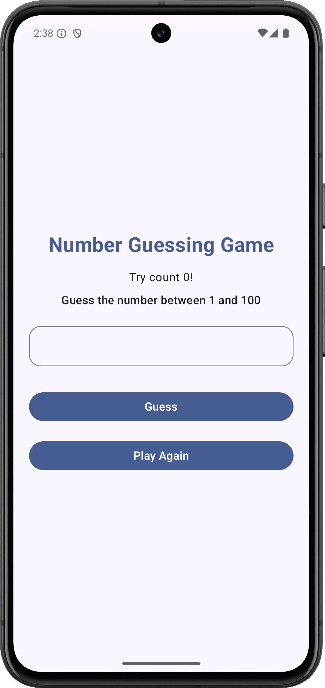
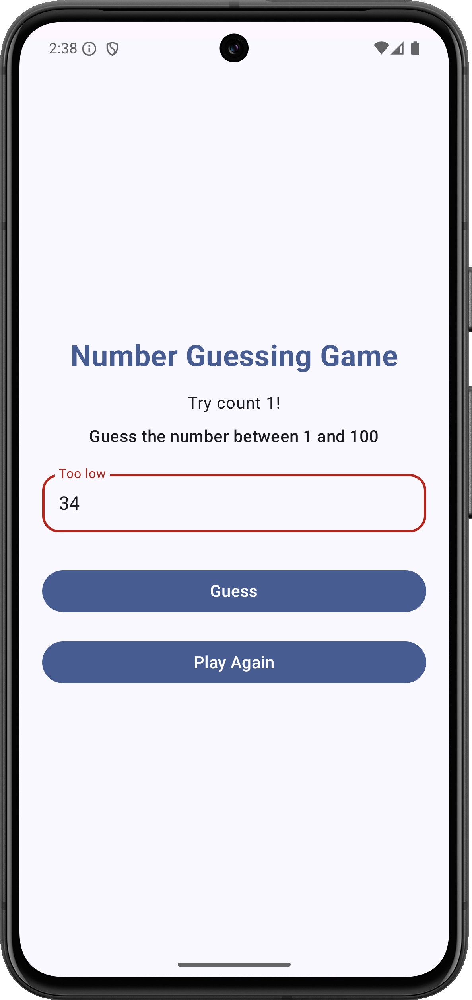
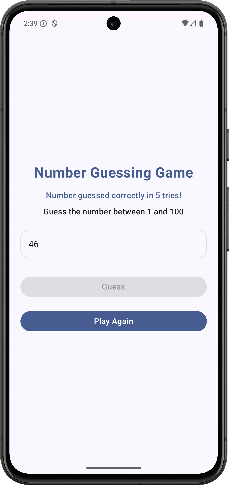
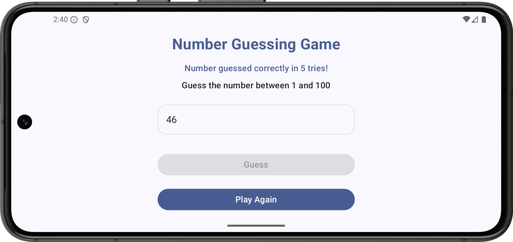
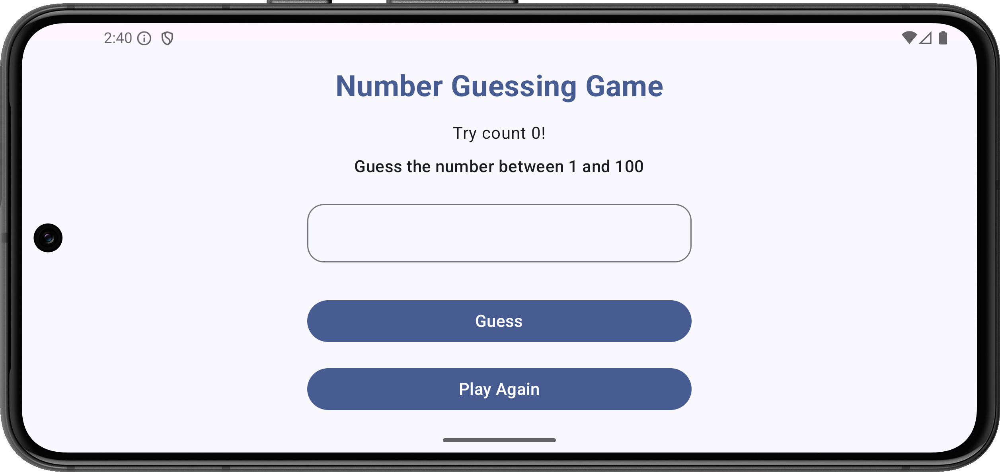

# Number Guessing Game

Number Guessing Game – A simple game where the user tries to guess a randomly generated number. The app gives hints if the guess is too high or too low until the correct number is found.

## Screenshots 

#### Game Screens

